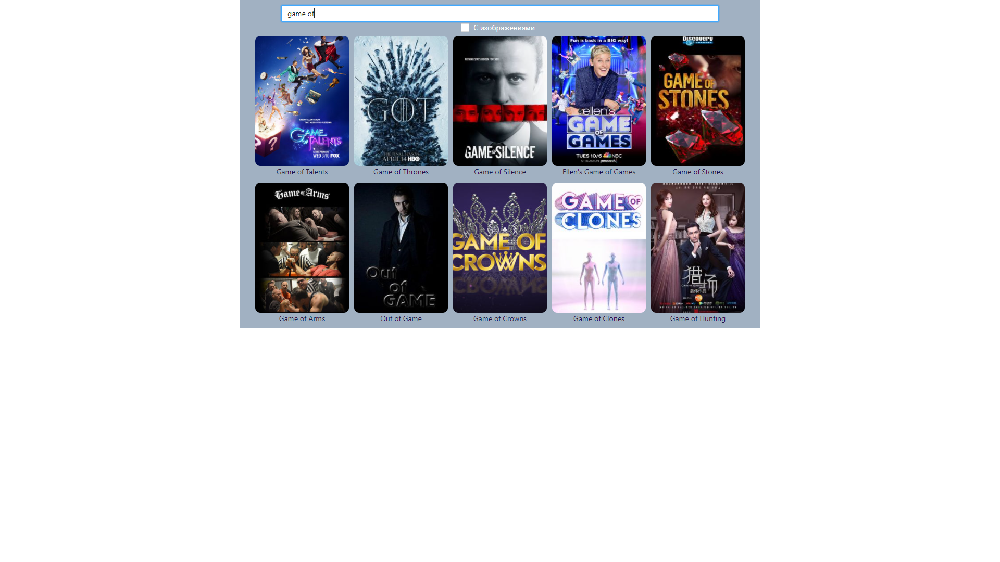

<h1>Сервис по поиску сериала</h1>

<a style='text-align: center;'href='https://slavasvirov.github.io/TVShows'>LIVE DEMO</a>

Проект реализован на ReactJs. Данные по сериалам получаю через TVMaze.api. Видео трейлера через Youtube API. Реализован поиск, чекбокс-фильтр, фильтр по эпизодам. 

